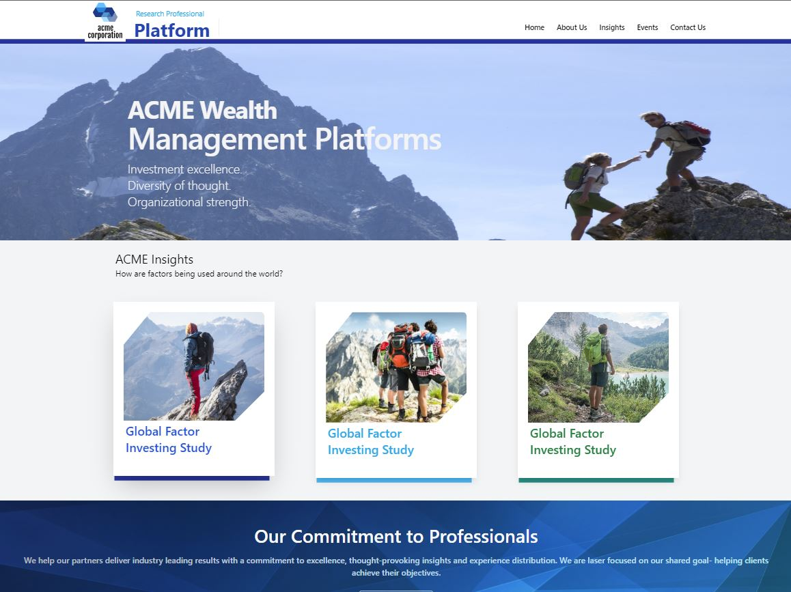

# ACME WEB Site

This project was bootstrapped with

`Create React App` and `Tailwind CSS`

## Available Scripts

`npm install` to install node modules and some dependencies of the project.

`npm start` to start local development

## To clone the project

`git clone` https://github.com/rcode321/Acme.git

then cd to the name of the project in this it's `Acme`

## Here some screenshot of the project

# Desktop Mode

# Mobile View

Runs the app in the development mode.\
Open [http://localhost:3000](http://localhost:3000) to view it in your browser.

## Thanks Happy Coding 🙂
